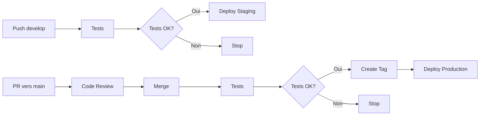

# API TODO - CI/CD Multi-Environnements

[](https://github.com/Dauv3514/api-todo-ci/actions/workflows/deploy-multi-env.yml)


API TODO avec pipeline CI/CD professionnel et déploiement automatique multi-environnements (staging & production).

---

## 🚀 Environnements Déployés

| Environnement | URL | Branche | Status |
|---------------|-----|--------|--------|
| **Production** | https://api-todo-valentin-dauvier-prod.onrender.com | `main` | Actif |
| **Staging** | https://api-todo-valentin-dauvier-staging.onrender.com | `develop` | Actif |

---

---
## Workflow de Déploiement

---

## Endpoints API
| Méthode | Route | Description | Exemple |
|---------|-------|-------------|---------|
| GET | `/` | Infos de l'API | `curl https://api-todo-valentin-dauvier-prod.onrender.com/` |
| GET | `/todos` | Liste tous les todos | `curl https://api-todo-valentin-dauvier-prod.onrender.com/todos` |
| GET | `/todos/:id` | Un todo spécifique | `curl https://api-todo-valentin-dauvier-prod.onrender.com/todos/1` |
| POST | `/todos` | Créer un todo | `curl -X POST ... -d '{"title":"..."}` |
| PUT | `/todos/:id` | Modifier un todo | `curl -X PUT ... -d '{"completed":true}'` |
| DELETE | `/todos/:id` | Supprimer un todo | `curl -X DELETE ...` |
| GET | `/health` | Health check | `curl https://api-todo-valentin-dauvier-prod.onrender.com/health`
---
## Tests
```bash
# Installer les dépendances
npm install
# Lancer les tests
npm test
# Tests avec coverage
npm test -- --coverage
```
**Coverage actuel : 8 tests passent **
---
## Pipeline CI/CD
Le pipeline s'exécute automatiquement :
### Sur `develop` (Staging)
1. Tests unitaires
2. Déploiement automatique sur Staging
3. Health check automatique
### Sur `main` (Production)
1. Tests unitaires
2. Création tag version (v1.0.x)
3. Déploiement automatique sur Production
4. Health check automatique
5. Push du tag vers GitHub
---
##Bonnes Pratiques Appliquées
- **Branches protégées** : Impossible de push directement sur `main`
- **Code review** : PR obligatoires avec validation
- **Tests automatiques** : Aucun déploiement sans tests verts
- **Environnements séparés** : Staging pour tester, Production pour users
- **Versioning sémantique** : Tags automatiques à chaque release
- **Health checks** : Vérification automatique après déploiement
- **Secrets management** : Clés API dans GitHub Secrets
- **Rollback facile** : Via tags Git ou interface Render
---
## Configuration Locale
```bash
# Cloner le repository
git clone https://github.com/Dauv3514/api-todo-ci.git
cd api-todo-ci
# Installer les dépendances
npm install
# Lancer en développement
npm start
# Lancer les tests
npm test
```
L'API sera accessible sur `http://localhost:3000`
---
## Variables d'Environnement
| Variable | Staging | Production |
|----------|---------|------------|
| `NODE_ENV` | `staging` | `production` |
| `PORT` | Auto (Render) | Auto (Render) |
---
## Projet réalisé dans le cadre du cours CI/CD
**MyDigitalSchool - Janvier 2026**
### Technologies utilisées
- Node.js 18.x
- Express 4.x
- Jest 29.x
- GitHub Actions
- Render.com
### Auteur
**Votre Prénom Nom** - [GitHub](https://github.com/Dauv3514)
---
## Ressources
- [Documentation GitHub Actions](https://docs.github.com/actions)
- [Documentation Render](https://render.com/docs)
- [Semantic Versioning](https://semver.org/)
- [Conventional Commits](https://www.conventionalcommits.org/)